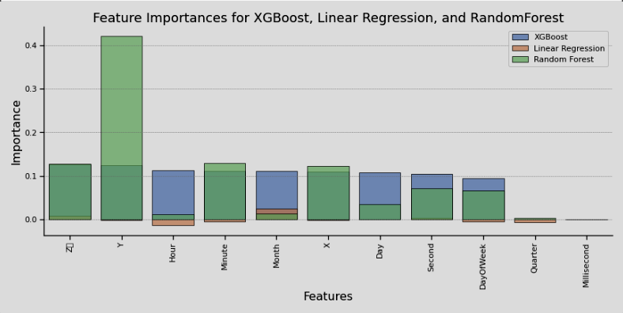
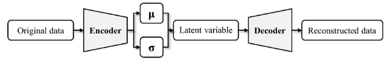

# Surrogate Simulation for Earthquake Prediction

#### Vishal Kamalakrishnan, Zach Russell, Kevin Ma, and Justin Zheng
#### Research Mentors: Prof. Geoffrey Fox, Prof. Judy Fox, Md. Khairul Islam
#### UVA-MLSYS Summer Research Program 2023

## Project Overview
Our mission is to develop earthquake prediction model that combines the accuracy and efficiency. Earthquakes, with their sudden and devastating impact, call for timely and reliable solutions to minimize their consequences on society and infrastructure. Our goal is to create a surrogate model that matches the precision of traditional physics-based models while drastically reducing computation time

We compared many iterative models including XGB Regressor, Support Vector Regression, MLP Regressor, Linear Regression, and Random Forest. We evaluated each model's strengths and weaknesses including their accuracy and feature importance. Based on our research we were able to recommend a hypothetical model for VAE employing generative and iterative solutions to better model earthquakes, as well as suggest several other options that could be feasibly be developed in the near future

## Resources
We utilized Prof. John Rundle's ETAS simulation code to build a surrogate model out of. 
- [How to run ETAS](./instructions.md)
- Citations and links can be found in our Github Pages https://uva-mlsys.github.io/SurrogateSimulation/data_visualization.html

## Repository Contents
- Formatted_ETAS_Output.csv : formatted output from ETAS simulation code which serves as the input data for the surrgoate
- proposal.md : our research proposal
- data_visualization.ipynb : input data and charts off of ETAS
- earthquake_surrogate.ipynb : our surrogate simulation code and models comparison and results
- vae_model.md : proposed new VAE model
- next_steps.md : next steps towards research

The gh-pages branch has access to the github pages static site made using Jupyter Book

## Comparison Of Models

A comprehensive overview of the models can be found in earthquake_surrogate.ipynb and discussed in our GitHub Pages

## VAE Model

Our proposed new model uses generative data in order to accurately simulate the randomness of earthquakes. It works using an encoder and decoder after transformation and will be trained using the data from ETAS model. For more information about the proposed model check out the Github Pages

## Acknowledgment
We would like to our advisors Prof. Judy Fox, Prof. Geoffrey Fox, and Md. Khairul Islam for their assistance with this project and their guidance and mentorship

